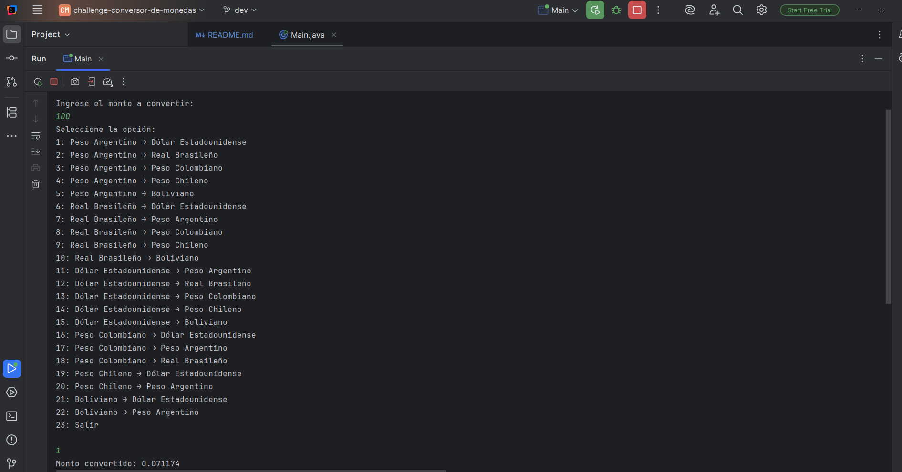
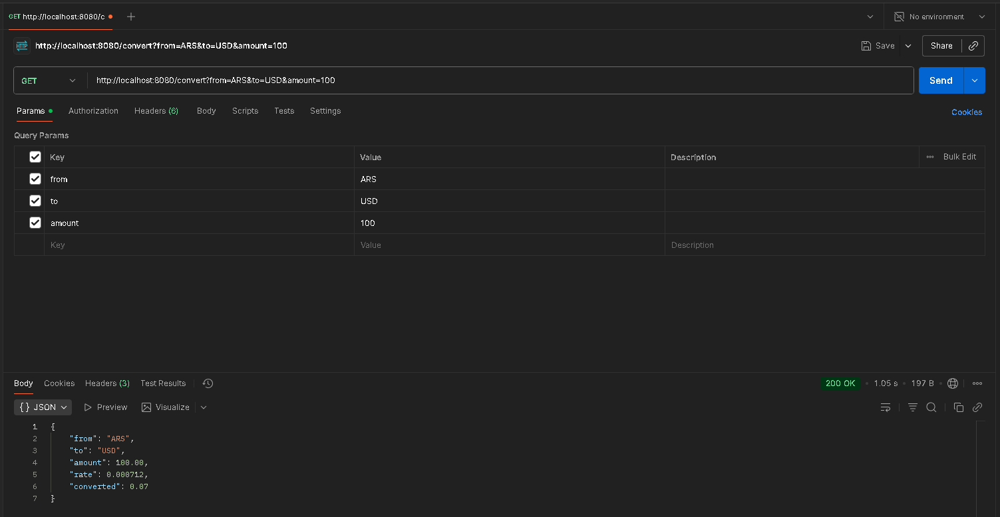

# Conversor de Monedas
### Challenge ONE | Oracle + Alura


> Una aplicación en Java que permite convertir entre monedas latinoamericanas y el dólar estadounidense, obteniendo tasas en tiempo real desde una API externa.

---

## 📌 Índice

- [Descripción del proyecto](#-descripción-del-proyecto)
- [Funcionalidades](#-funcionalidades)
- [Tecnologías utilizadas](#-tecnologías-utilizadas)
- [Requisitos](#-requisitos)
- [Cómo usar](#-cómo-usar)
  - [Modo consola](#modo-consola)
  - [Modo API REST (con Postman)](#modo-api-rest-con-postman)
- [Monedas soportadas](#-monedas-soportadas)
- [Capturas de pantalla](#-capturas-de-pantalla)
- [Desarrollado por](#-desarrollado-por)
- [Licencia](#-licencia)

---

## 📝 Descripción

Este proyecto forma parte del **Challenge ONE** de Oracle + Alura, y tiene como objetivo aplicar conceptos clave de programación en Java, como:
- Consumo de APIs REST,
- Análisis de respuestas JSON con la biblioteca **Gson**,
- Manejo de excepciones personalizadas,
- Interacción con el usuario mediante consola,
- Creación de una API REST para pruebas con **Postman**.

El conversor obtiene las **tasas de cambio en tiempo real** desde [ExchangeRate-API](https://www.exchangerate-api.com/) y permite convertir montos entre monedas seleccionadas.

---

## ✨ Funcionalidades

- ✅ Conversión entre 6 monedas oficiales del desafío.
- ✅ Interfaz de consola con menú interactivo y bucle de navegación.
- ✅ API REST (`/convert?from=...&to=...&amount=...`) lista para probar en Postman.
- ✅ Validación de monedas permitidas (filtrado según fase 8).
- ✅ Manejo robusto de errores (clave inválida, red, monedas no soportadas, etc.).
- ✅ Código modular: separación clara entre lógica de negocio, utilidades y manejo de errores.

---

## 🛠 Tecnologías utilizadas

| Herramienta | Uso |
|-----------|-----|
| **Java 17+** | Lenguaje principal (usa `HttpClient`, `String.format`, texto en bloque con `"""`, etc.) |
| **Gson** | Parseo y análisis de respuestas JSON (`JsonParser`, `JsonObject`) |
| **ExchangeRate-API** | Fuente de tasas de cambio en tiempo real |
| **Postman** | Pruebas de la API REST |
| **HttpServer (JDK)** | Servidor HTTP nativo para exponer el endpoint |

---

## ⚙️ Requisitos

- JDK 17 o superior
- Una clave API gratuita de [ExchangeRate-API](https://www.exchangerate-api.com/)
- (Opcional) Postman para probar la API REST

---

## 🚀 Cómo usar

### Modo consola

1. Clona el repositorio:
   ```bash
   git clone https://github.com/AlanVolta/challenge-conversor-de-monedas.git
   ```
   
2. Crea un archivo `config.properties` en la raíz del proyecto:
    ```properties
    apiKey=tu_clave_aquí
    ```
3. Compila y ejecuta:
    ```bash
    javac -d out $(find . -name "*.java")
    java -cp out com.alan.conversor.principal.Main
    ```
4. Sigue las instrucciones en consola.

### Modo API REST (con Postman)

1. Ejecuta la clase `HttpServerApp` (en el paquete `servidor`).
2. Abre Postman y envía una solicitud GET:
   ```
   GET http://localhost:8080/convert?from=USD&to=ARS&amount=100
   ```
3. Recibirás una respuesta JSON con la conversión.
> 📌 **Nota**: El servidor debe estar en ejecución para usar la API. 

## 💰 Monedas soportadas

El proyecto filtra y solo permite conversiones entre las siguientes monedas:

| Código | Moneda |
|--------|--------|
| `ARS`  | Peso argentino |
| `BOB`  | Boliviano boliviano |
| `BRL`  | Real brasileño |
| `CLP`  | Peso chileno |
| `COP`  | Peso colombiano |
| `USD`  | Dólar estadounidense |

## 🖼 Capturas de pantalla

### Consola


### Postman


## 👩‍💻 Desarrollado por

**Alan Rivera**  

